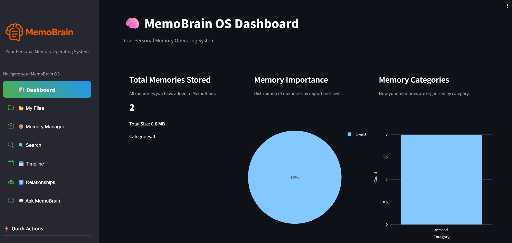
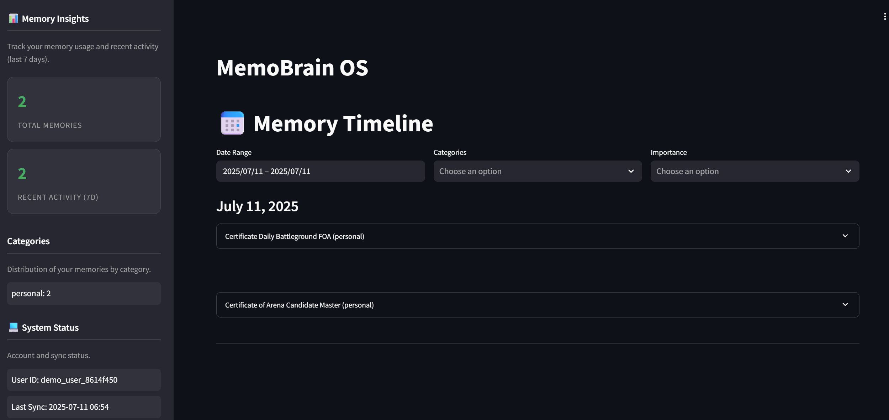
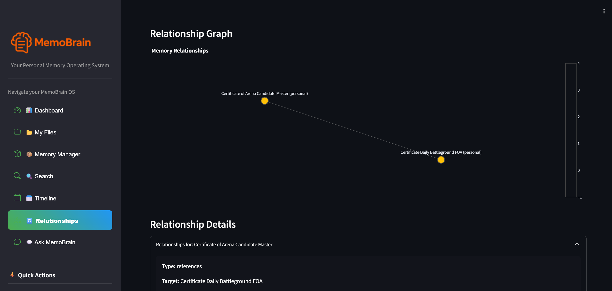
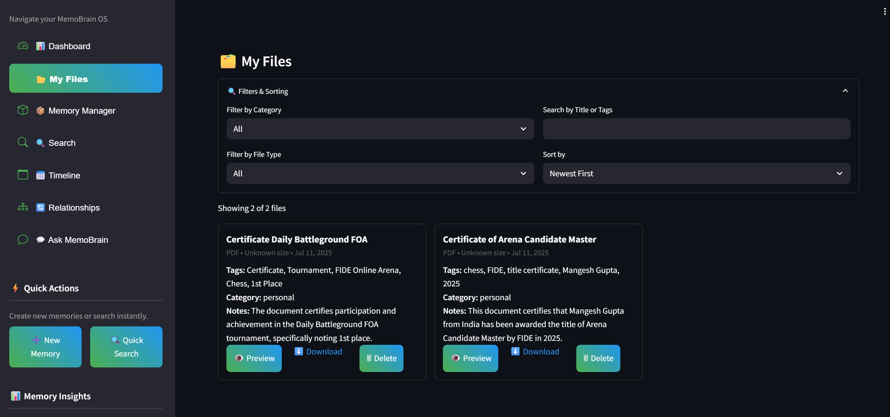

# MemoBrain OS - Your Personal Memory Operating System

MemoBrain OS is a sophisticated personal memory management system that helps you organize, connect, and retrieve your digital memories in a way that mimics how your brain works. It's not just a file manager or note-taking app—it's a complete operating system for your memories.

## 🌟 Key Features

### 🧠 Memory Management
- **Semantic Search**: Find memories using natural language queries
- **Multimodal Support**: Store and search through text, images, PDFs, and more
- **Memory Importance**: Automatically or manually assign importance levels to memories
- **Memory Relationships**: Create and visualize connections between related memories
- **Temporal Organization**: View and filter memories chronologically

### 📊 Dashboard
- Memory statistics and insights
- Importance distribution visualization
- Category distribution analysis
- Recent memories timeline
- Memory relationship graph


### 📅 Timeline View
- Chronological view of all memories
- Date range filtering
- Category and importance filtering
- Detailed memory metadata
- Quick access to related memories


### 🔄 Relationship Management
- Create connections between memories
- Visualize memory relationships in an interactive graph
- Different relationship types (references, depends_on, related_to, etc.)
- Relationship descriptions and metadata



### 🎯 Memory Features
- **Importance Scoring**: Automatic and manual importance assignment
- **Access Tracking**: Monitor how often memories are accessed
- **Context Preservation**: Store creation context and metadata
- **Version Control**: Track changes to memories over time
- **Auto-summarization**: AI-generated summaries of long content



## 🚀 Getting Started

1. Clone the repository:
```bash
git clone https://github.com/yourusername/memobrain.git
cd memobrain
```

2. Create a virtual environment and install dependencies:
```bash
python -m venv .venv
source .venv/bin/activate  # On Windows: .venv\Scripts\activate
pip install -r requirements.txt
```

3. Set up your OpenAI API key:
```bash
echo "OPENAI_API_KEY=your_api_key_here" > .env
```

4. Run the application:
```bash
streamlit run ui/app.py
```

## 💡 Usage Examples

### Creating a Memory
1. Upload a file or create a note
2. Add metadata (title, tags, category)
3. Set importance level
4. Add notes or context
5. Save to your memory system

### Finding Memories
- Use natural language search
- Filter by date, category, or importance
- Browse the timeline view
- Explore memory relationships
- Use the dashboard for insights

### Managing Relationships
1. Select a source memory
2. Choose a target memory
3. Define the relationship type
4. Add a description
5. Visualize in the relationship graph

## 🔧 Technical Details

### Architecture
- **Frontend**: Streamlit-based modern UI
- **Backend**: Python with OpenAI integration
- **Storage**: FAISS vector store for semantic search
- **Data**: JSON-based memory index with file storage

### Dependencies
- Streamlit for the web interface
- OpenAI for embeddings and summarization
- FAISS for vector similarity search
- NetworkX for relationship graphs
- Plotly for visualizations

## 🤝 Contributing

Contributions are welcome! Please feel free to submit a Pull Request.

## 📝 License

This project is licensed under the MIT License - see the LICENSE file for details.

## 🙏 Acknowledgments

- OpenAI for providing the AI capabilities
- Streamlit for the amazing web framework
- FAISS for efficient similarity search
- The open-source community for various tools and libraries